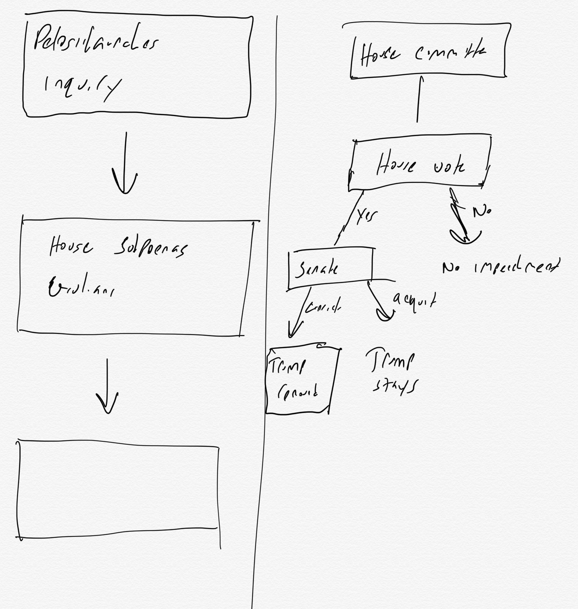
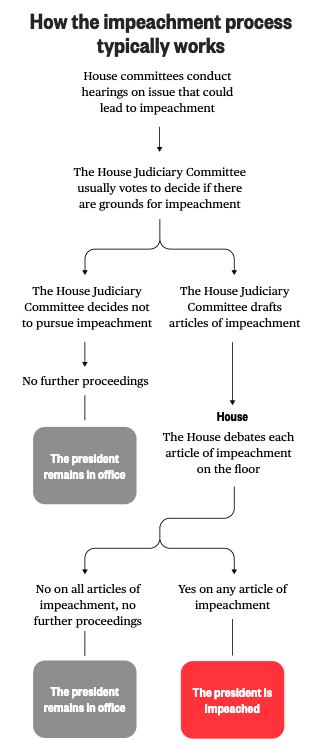
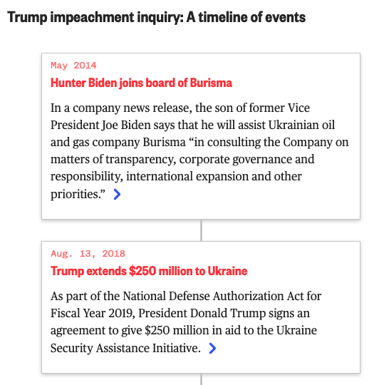

# Design for News
Permalink: [http://bit.ly/nnd-news-design](http://bit.ly/nnd-news-design)
One of the most fun aspects of working in a newsroom is that you get to decide how to tell your stories. Sometimes the straight linear text model isn't best way to convey a point. And when that happens, you get to be creative.

## Examples
- [Sesame Street's International Spinoffs](https://www.nbcnews.com/pop-culture/tv/sesame-street-50-years-old-around-world-n1079091)

This story is about how Sesame Street has expanded to dozens of countries around the world since it first aired 50 years ago. Going in, the one thing we wanted the reader to take away was that the show's reach was massive, hitting almost every corner of the world. So we settled in and built a globe that moves around and highlights countries as you scroll.

This type of interface, where the page animates or things happen as the user scrolls is called **scrollytelling.** It's basically a way to give the reader a guided tour through a section of the page. They scroll and something happens. They scroll again and something else happens.

- [Election Confessions](https://www.nbcnews.com/politics/2020-election/election-confessions-tell-us-how-you-really-feel-about-2020-n1017716)

One of NBC New's staples around election season is "Election Confessions." It's a place where people can go to confess a deep secret about the election without having their name attached to it. It's basically a comment section, we wanted it to have the feel of sticking a post-it note up on a wall, so we built this intricate sticky note system that lets people read what others have written and encourages them to share on their own.

[Scientists are weighing radical steps to save coral](https://www.washingtonpost.com/graphics/2019/climate-solutions/amp-stories/scientists-save-coral-reefs-climate-change/)

Anyone that's played around with Snapchat or Instagram stories will feel right at home with what the Washington Post did with this story. The idea is that the photos here are as important to the story as the text, so they built an stories-clone that lets the reader tap through one at a time.

- [How to fold a fitted sheet](https://www.nytimes.com/interactive/2019/08/06/multimedia/how-to-fold-a-fitted-sheet.html)

The New York Times uses the same instagram/Snapchat stories interface  here to guide the reader through a complex task. Don't be surprised if you see more and more Instagram stories clones popping up. It's a great way to let the reader control the story and go at their pace.

- [If the Moon were only one pixel](http://joshworth.com/dev/pixelspace/pixelspace_solarsystem.html)
This is a really long scrolling page that accurately demonstrates how vast the solar system is. It wasn't made by a journalist or a newspaper, but rather by an web designer who wanted to explain to his daughter how far away Mars was from the Earth.

The thing each of these experiences has in common is that there was a single goal the people who made them had. They wanted to convey one or two main things. And the teams then thought about the best way to express those points.

- [California's Wildfires are as big as 17 Manhattans](https://www.nbcnews.com/news/us-news/california-wildfires-2018-size-compare-us-cities-map-n935946)

The wildfires in California burn on a scale that is unfathomable to most of us. In this story, you can compare the size of three fires to any city around the world.

##  Tools
- [Figma](https://www.figma.com/)  Is a great tool for doing design mock-ups and jotting down ideas. If you have access to Adobe Creative Cloud, *Adobe XD* is a very similar app.
- [The Data Visualization Catalogue](https://datavizcatalogue.com/) is a guide to the many different types of charts and graphs that are available. It also includes links to tools you can use to make them, including several that don't involve any coding at all.
- [Datawrapper](https://datawrapper.de/) Is a free website that lets you generate charts, graphs, and maps without any code. It's very easy to use. Copy your data in from google sheets or excel, and you can have a chart in a few button clicks.
- [Knightlab Tools](https://knightlab.northwestern.edu/projects/): Northwestern University's Knightlab makes storytelling tools that journalists can use for free. They've got a timeline tool, an annotated chart tool, a before-after image slider and more.

##  So how do you do any of this?
- **Think about what your goal is.** What do you want the reader to learn? Try to boil it down to one thing: "I want to show that Sesame Street has spread across the world." "I want to show that the California wildfires are huge." Once you know what your goal is, it's easier to pick a tool to get the job done.
- **Come up with a sketch.** I use Pen and paper or an iPad with a pencil to do sketches. Sketching is great because it helps you turn a vague idea into something a bit more concrete.
 

- **Look around. See what other people are doing.** Our team at NBC News has a slack channel called dataviz-inspiration where we share what we've seen around the web. That way we can pick and choose things we like and save them for later. There are plenty of teams doing great work. But here are a few:
  - [NYT Graphics](https://twitter.com/nytgraphics)
  - [WSJ Graphics](https://graphics.wsj.com/)
  - [NBC News Data Graphics](https://www.nbcnews.com/datagraphics)
  - [The Pudding](https://pudding.cool/)
  - [Washington Post Graphics](https://postgraphics.tumblr.com/)
- **Get creative.** Our teams are very experienced and know how to code. But creativity will trump technical ability every time. Do you think Instagram Stories is the perfect way to tell your story but you don't know how to code? Make another instagram account, post your story and save it as a highlight. Have the right idea but there's no tool to make it? Draw it. In the end, the only thing that matters is your story.

**Next week:** Hands on and putting it all together.