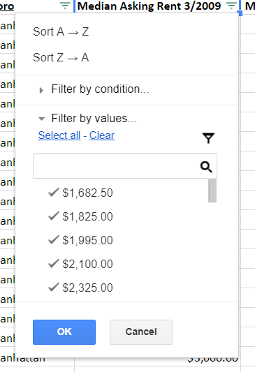
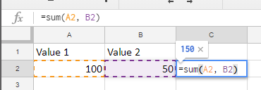

# Session 2: Working with Data

Okay, so in the previous session we went over what data is and how you can use to strengthen your reporting. Today we're going to look at how to analyize the data we find. Because ofthe data's goign to be a mess, and it's up to us to make sense of it, find patterns and find stories.

Most of the time, when you get data, it's going to come in either **spreadsheet** or **pdf** form. Spreadsheets are the preferred way, because it's easy to take spreadsheet data and turn it into charts and web projects.

- **Tip**: When trying to download data, look for files that end in **.xls**, **.xlsx**, **.csv**, or **tsv**. Those are ones you can easily analyze. 

Once you've got a file, you can open it up [Google Sheets](https://sheets.google.com), which is free and absolutely fantastic for making sense of data. *We'll be working in Google Sheets from here on out.*

## Don't be afraid of spreadsheets!

I know, they look intimidating and they make you want to fall alseep, but they're actually a very orderly way to keep track of large amounts of information.

So let's take a look at a typical spreadsheet:

### <a href="https://docs.google.com/spreadsheets/d/1nb_EQh4vNWn-pTn9winay5x4VkBA5MKGtKOqyxVlRzw/edit?usp=sharing" target="blank">Today's worksheet</a>

It's a selection of datasets (groups of information) from a bunch of sources across the city that you'd probably deal with very often as a metro reporter. It includes:

- Median Asking Rents in New York City neighborhoods between 2009 and 2019.
- The vote count from last night's Public Advocate Election
- The total number of votes for last fall's governor's election

Open it, then select **File > Make a Copy** to create a copy for yourself. 

(Microsoft Excel looks generally the same)

There are a couple of key concepts to know when it comes to spreadsheets.

- A vertical line of boxes is called a **column**. (You know, like columns in a building.)
  - Columns are identified by the letter above the first square. (So the first column is named A, the second is named B, and so on.)
- A horizontal line of boxes is called a **row**.
  - Rows are identified by the number in the right left corner. So the first row is 1, the second is 2.
- Each little spreadsheet box is called a **cell.** Cells each have their own unique ID number that comes from the **Column Letter** and the **Row Number**. So the very first cell is named A1. The one to the right of it is named B1. The one below A1 is A2.
- Little section below the toolbar is called the **Formula Bar**. It displays the contents of the cell you've clicked, and it's also where you can write **functions,** which are awesome little commands that you can use to do cool things to the information in your spreadsheet.
- At the very bottom of the page there are little tabs. These tabs are called **worksheets**. A spreadsheet can have multiple worksheets, and you can get send information back and forth between each worksheet. (More on this in a later session.)

For most spreadsheets, the first row contains **Headers**, which are basically just descriptions of what's included. And each row is usually a separate instance of data.

## Working With Data

Now, before we can work with the data, the first thing we have to do is make sure it's in a workable state. A lot of times we'll download data and it will contain a bunch of junk that we don't care about. Fortunately, there are two quick tools we can use to try to quickly find what we're looking for: **sort** and **filter**.

## Sort and Filter

These commands let you do exactly what they sound like. Sort let you arrange the rows in the spreadsheet based on one of the columns headers, and filter lets you temporarily hide rows that you don't need to see.

Both commands can be accessed by highlighting your column header and then clicking this icon:

One you do that you'll see little upside-down triangles next to each column header. Clicking a triangle will open a up a little box that gives you the option to sort the spreadsheet and filter out views.

**Try it**: In the **Sort and Filter** tab, Try to sort the table from high to low by column DH, or rents from January 2019. This will quickly tell us which neighborhood or area had the most expensive rent listings last  month.

Then try filtering according to Column A and remove everything except Flatiron.

## Functions

As mentioned above, functions are little instructions that you can use to quickly do math, or format text.

Functions usually have the following syntax:

**=FUNCTION_NAME(First Cell, Second Cell)**

Take for example the screenshot below:

If I wanted to add the values A2 and B2, I would use the **SUM** function and write:

**=SUM(A2, B2)**

You can also quickly add up a range of numbers by writing **=SUM(First Cell:Last Cell)**

## Other Common Functions:

- =AVERAGE: This lets you get the average of a group of numbers
- =MEDIAN: Finds the median number (the middle number in a group of numbers)
- =PRODUCT: Lets you multiply numbers
- =PROPER: Turns WiErD and SHOUTY text into properly formatted text
- =COUNT: Counts the number of rows in a column

## Percent Change 
To find out how two numbers have changed, you can calcuate the percent change. The formula is
- **=((new -old)/old)**

  **Try It**: In the Median Rent worksheet, calculate the percent change in neighborhood rent prices.

Your Homework:
Take a look at the campaign contributions worksheet. It lists everyone who donated to the Mayor deBlasio's re-election campaign. Using this work sheet, I want you to figure out:

1- How many people contibuted the maximum allowable contribution of $4,950 (So filter out every donation except the max, copy the filtered data into a new worksheet and then use the COUNT function)
2- What was the average contribution across all donors? (Use the AVERAGE function)
3- Write this information in a sentence or two as if it were going into a news story. Email it to us.

## Further Reading
- [Common Excel Functions](../resources/CommonFormulasFunctions.pdf)